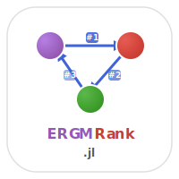

# ERGMRank.jl


[](https://github.com/statistical-network-analysis-with-Julia/ERGMRank.jl)
[](https://github.com/statistical-network-analysis-with-Julia/ERGMRank.jl/actions/workflows/CI.yml?query=branch%3Amain)
[](https://statistical-network-analysis-with-Julia.github.io/ERGMRank.jl/stable/)
[](https://statistical-network-analysis-with-Julia.github.io/ERGMRank.jl/dev/)
[](https://julialang.org/)
[](https://opensource.org/licenses/MIT)

<p align="center">
  
</p>

ERGMs for rank-order relational data in Julia.

## Overview

ERGMRank.jl implements exponential-family random graph models for networks
whose edge values are **ranks**: each ego rank-orders all alters (Krivitsky
& Butts 2017). The sample space is the set of complete orderings of the
alters by each ego, with the discrete-uniform `CompleteOrderReference` over
orderings — exactly the setting of the R `ergm.rank` package, of which this
is a Julia port.

**Convention** (matching `ergm.rank`): greater rank values indicate higher
standing; `get_rank(rnet, i, j) > get_rank(rnet, i, k)` means ego `i` ranks
`j` over `k`. Each ego's ranks must form a permutation of `1:(n-1)` — this
invariant is validated at construction and preserved by `swap_ranks!` (the
AlterSwap move).

## Installation

Requires Julia 1.12+ and the unregistered ERGM.jl:

```julia
using Pkg
Pkg.add(url="https://github.com/statistical-network-analysis-with-Julia/Network.jl")
Pkg.add(url="https://github.com/statistical-network-analysis-with-Julia/ERGM.jl")
Pkg.add(url="https://github.com/statistical-network-analysis-with-Julia/ERGMRank.jl")
```

## Terms

All statistics are validated against R `ergm.rank` 4.1.2 on golden-master
fixtures (see `test/runtests.jl`):

| Term | ergm.rank counterpart | Meaning |
|------|----------------------|---------|
| `RankDeference()` | `rank.deference` | Triples where l ranks j over i while i ranks l over j |
| `RankNonconformity(:all)` | `rank.nonconformity("all")` | Pairwise disagreements in alter comparisons |
| `RankNonconformity(:localAND)` | `rank.nonconformity("localAND")` | Local nonconformity with higher-ranked actors |
| `RankNodeICov(x)` | `rank.nodeicov` | Attractiveness/popularity covariate |
| `RankInconsistency(ref)` | `rank.inconsistency` | Disagreement with a reference ranking |
| `RankEdgeCov(cov)` | `rank.edgecov` | Dyadic covariate |

## Quick Start

```julia
using ERGMRank

# Rank matrix: row i holds ego i's ranks (greater = higher standing)
m = [0 3 2 1;
     3 0 1 2;
     1 3 0 2;
     2 1 3 0]
rnet = as_rank_network(m)

# Statistics
compute(RankDeference(), rnet)              # 6.0 (matches R)
compute(RankNodeICov([10, 20, 30, 40]), rnet)  # -40.0 (matches R)

# Fit by swap-based maximum pseudo-likelihood
result = ergm_rank(rnet, [RankDeference()])

# Simulate with AlterSwap Metropolis sampling
draws = simulate_rank_ergm(rnet, [RankDeference()], [0.5]; n_sim = 100)
all(is_valid_ranking, draws)  # true — every draw is a complete ranking
```

## Estimation

`ergm_rank` maximizes the **swap-based pseudo-likelihood**: for each ego
and each unordered pair of alters, the conditional probability of their
observed relative order given the rest of the rankings is logistic in
`θ'[g(y) − g(y_swapped)]`. This is the rank analogue of dyadwise MPLE (the
AlterSwap move replaces the edge toggle) and a fast, consistent
approximation to `ergm.rank`'s MCMC MLE; like all pseudo-likelihoods it
understates uncertainty for strongly dependent models.

## Simulation

`simulate_rank_ergm` runs Metropolis sampling with the symmetric AlterSwap
proposal (pick an ego and two alters; propose swapping their ranks; accept
with probability `min(1, exp(θ'Δg))`). Every state visited is a valid
complete ranking, and the chain targets `P(y) ∝ exp(θ'g(y))` on the
complete-ordering space.

## References

1. Krivitsky, P.N. & Butts, C.T. (2017). Exponential-family random graph
   models for rank-order relational data. *Sociological Methodology*,
   47(1), 68-112.

2. Krivitsky, P.N. (2012). Exponential-family random graph models for
   valued networks. *Electronic Journal of Statistics*, 6, 1100-1128.

3. Krivitsky, P.N., Butts, C.T., et al. ergm.rank: Fit, Simulate and
   Diagnose Exponential-Family Models for Rank-Order Relational Data.
   R package. [https://cran.r-project.org/package=ergm.rank](https://cran.r-project.org/package=ergm.rank)

## License

MIT License - see [LICENSE](LICENSE) for details.
