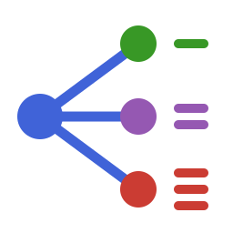

# ERGMRank.jl


[](https://github.com/statistical-network-analysis-with-Julia/ERGMRank.jl)
[](https://github.com/statistical-network-analysis-with-Julia/ERGMRank.jl/actions/workflows/CI.yml?query=branch%3Amain)
[](https://statistical-network-analysis-with-Julia.github.io/ERGMRank.jl/dev/)
[](https://julialang.org/)
[](https://opensource.org/licenses/MIT)

<p align="center">
  
</p>

ERGMs for rank-order relational data in Julia.

## Overview

ERGMRank.jl implements exponential-family random graph models for networks
whose edge values are **ranks**: each ego rank-orders all alters (Krivitsky
& Butts 2017). The sample space is the set of complete orderings of the
alters by each ego, with the discrete-uniform `CompleteOrderReference` over
orderings — exactly the setting of the R `ergm.rank` package, of which this
is a Julia port.

**Convention** (matching `ergm.rank`): greater rank values indicate higher
standing; `get_rank(rnet, i, j) > get_rank(rnet, i, k)` means ego `i` ranks
`j` over `k`. Each ego's ranks must form a permutation of `1:(n-1)` — this
invariant is validated at construction and preserved by `swap_ranks!` (the
AlterSwap move).

## Installation

Requires Julia 1.12 or newer. The packages are not yet registered.

**Recommended: the ecosystem workspace.** It clones every package side by
side, develops them together in one environment, and adds the packages the
examples also use (CSV, DataFrames, Distributions, Graphs, StatsAPI,
StatsBase):

```bash
mkdir network-analysis && cd network-analysis
git clone https://github.com/statistical-network-analysis-with-Julia/statistical-network-analysis-with-Julia.github.io
julia statistical-network-analysis-with-Julia.github.io/tools/prepare_workspace.jl "$PWD" --clone
julia --project=.snippet-env
```

**Only this package, in your own environment.** Add its dependencies first,
in this order:

<!-- skip-check -->
```julia
using Pkg
Pkg.add(url="https://github.com/statistical-network-analysis-with-Julia/NetworkCore.jl")
Pkg.add(url="https://github.com/statistical-network-analysis-with-Julia/ERGM.jl")
Pkg.add(url="https://github.com/statistical-network-analysis-with-Julia/ERGMRank.jl")
```

The examples below load only `ERGMRank`, `NetworkCore` and the standard
libraries `Random` and `Statistics`.

## Coming from `ergm.rank`

An `ergm.rank` session is a fit call whose `response=` and `reference=`
arguments select the rank model, a `control.ergm` with the MCMC budget, and
`summary`/`simulate`/`gof` on the fit. Each maps to one call here, and the
default estimator is the same: `ergm_rank` fits the **MCMC MLE**, as `ergm()`
does. The one thing that does not map one-to-one is the **log-likelihood
convention** (see [Estimation](#estimation)).

| R `ergm.rank` | ERGMRank.jl |
|---|---|
| `ergm(nw ~ rank.deference + rank.nonconformity("all"), response="rank", reference=~CompleteOrder, control=control.ergm(MCMC.samplesize=2048, MCMC.burnin=8192, MCMC.interval=512))` | `ergm_rank(as_rank_network(net), [RankDeference(), RankNonconformity(:all)]; n_samples=2048, burnin=8192, interval=512)` |
| `response="rank"` (the edge attribute holding the ranks) | `as_rank_network(net; attr=:rank)` — the `RankNetwork` type *is* the rank response |
| `reference=~CompleteOrder` | implicit: `CompleteOrderReference` is the only reference measure, carried on every fit |
| `rank.inconsistency(x, weights=w, wtname="w", wtcenter=TRUE)` | `RankInconsistency(x; weights=w, wtname="w", wtcenter=true)` (`w` an `n×n×n` array or a function `(i, j, k) -> weight`) |
| `summary(fit)` | `display(fit)` (the R-style block; the REPL prints it) / `coeftable(fit)` (the same table as an object); `coef`, `stderror`, `confint`, `logLik`→`loglikelihood`, `AIC`/`BIC`→`aic`/`bic`, `nobs` |
| `simulate(fit, nsim=100)` | `simulate_rank_ergm(fit; n_sim=100)` (`burnin`/`interval` default to the swap-scaled rule) |
| `gof(fit)` | `gof(fit)` (the shared `NetworkCore.gof`; `n_sim`, `burnin`, `interval`, `rng`) — model statistics plus auxiliary panels |
| — (no counterpart) | `ergm_rank(...; method=:mple)`: the swap pseudo-likelihood, an estimator of this package |

`data(newcomb); newcomb[[1]]` is `newcomb_week1()`; `summary(nw ~ rank.deference, response="rank")`
is `compute(RankDeference(), rnet)`; `control.ergm(seed=)` is the `rng=` keyword
(`rng=Xoshiro(1)`), on every call that draws.

## Terms

All statistics are validated against R `ergm.rank` 4.1.2 on golden-master
fixtures generated by the checked-in `test/fixtures/r/*.R` scripts, each with
a `[provenance]` block: `rank_terms.toml` (every term's `summary()` value on
the 4-actor network below and on a seeded 8-actor ranking),
`rank_inconsistency_weights.toml` (the weighted inconsistency, for a function
and an array of weights, centred and not) and two fitted models on Newcomb's
fraternity (`newcomb_rank.toml`, `newcomb2_rank.toml`; see
[Estimation](#estimation)).

| Term | ergm.rank counterpart | Meaning |
|------|----------------------|---------|
| `RankDeference()` | `rank.deference` | Triples where l ranks j over i while i ranks l over j |
| `RankNonconformity(:all)` | `rank.nonconformity("all")` | Pairwise disagreements in alter comparisons |
| `RankNonconformity(:localAND)` | `rank.nonconformity("localAND")` | Local nonconformity with higher-ranked actors |
| `RankNodeICov(x)` | `rank.nodeicov` | Attractiveness/popularity covariate |
| `RankInconsistency(ref; weights, wtname, wtcenter)` | `rank.inconsistency(x, attrname, weights, wtname, wtcenter)` | (Weighted) disagreement with a reference ranking |
| `RankEdgeCov(cov)` | `rank.edgecov` | Dyadic covariate |

Covariates and reference rankings are passed as values (a vector, a matrix,
a `RankNetwork`), not as attribute names: a `RankNetwork` carries no
attributes.

## Quick Start

```julia
using ERGMRank   # exports the shared `compute`/`name` verbs, the StatsAPI surface
                 # and the result-metadata protocol: nothing else is needed

# Rank matrix: row i holds ego i's ranks (greater = higher standing)
m = [0 3 2 1;
     3 0 1 2;
     1 3 0 2;
     2 1 3 0]
rnet = as_rank_network(m)

# Statistics
compute(RankDeference(), rnet)              # 6.0 (matches R)
compute(RankNodeICov([10, 20, 30, 40]), rnet)  # -40.0 (matches R)

# Fit by MCMC maximum likelihood, ergm.rank's estimator (the default)
using Random
result = ergm_rank(rnet, [RankNodeICov([10, 20, 30, 40])]; rng = Xoshiro(1))
# fit_ergm_rank is the standardized entry point (fit_<model> naming);
# ergm_rank is the statnet-style name of the same function
result.converged          # true
display(result)           # the R-style block the REPL prints; print/string give one line
coeftable(result)         # that table, as an object
coef(result), stderror(result), confint(result)
aic(result), bic(result)  # from the path-sampling estimate of the log-likelihood
approximations(result)    # what the estimator did NOT do exactly (the shared metadata protocol)

# Check the fit: the model statistics and auxiliary statistics of the
# ranking against their distribution under the fitted model
gof(result; n_sim = 100, rng = Xoshiro(2))

# Simulate with AlterSwap Metropolis sampling
draws = simulate_rank_ergm(rnet, [RankDeference()], [0.5]; n_sim = 100)
all(is_valid_ranking, draws)  # true — every draw is a complete ranking
```

### From a `Network`

R's `ergm.rank` data (`newcomb`) are `network` objects whose edge attribute
`"rank"` carries ego *i*'s rank of *j* on the arc *i → j*
(`as.matrix(nw, attrname = "rank")`). The same shape in Julia — a directed
`NetworkCore.Network` with a rank edge attribute — converts with
`as_rank_network(net; attr=:rank)`, honouring the ecosystem's conversion
contract: the ranks and the actor set are **preserved**; an undirected or
two-mode network, a **masked (unobserved) dyad** (there is no `missing=:face`
— an unobserved rank has no face value), a dyad without a rank and an ego
whose ranks are not a permutation of `1:(n-1)` are **rejected** with an
`ArgumentError` naming the ego and the attribute; every other edge, vertex
and network attribute is **dropped and reported** (`report=true` returns a
`NetworkCore.ConversionReport`).

```julia
using NetworkCore
net = network(4)                          # directed: a ranking is ego-specific
for i in 1:4, j in 1:4
    i == j && continue
    add_edge!(net, i, j)
    set_edge_attribute!(net, :rank, i, j, m[i, j])
end
set_vertex_attribute!(net, :age, [20, 30, 40, 50])
rnet, rep = as_rank_network(net; report=true)
rank_matrix(rnet) == m                    # true
dropped_fields(rep)                       # [:age]: a RankNetwork has no vertex attributes
supports_missing(as_rank_network), missing_policies(as_rank_network)   # (true, (:error,))
```

## Estimation

`ergm_rank` (= `fit_ergm_rank`) has two estimators, selected by `method=`.

**`method=:mcmle`** (the default) is the **MCMC maximum likelihood
estimate** — the estimator of `ergm.rank`, on the iteration of `ERGM.mcmle`:
from the swap-MPLE (or `init=`), each iteration samples the model
statistics along the AlterSwap chain at the current θ and takes a
Hummel-stepped Newton step toward the observed statistics — at every
iteration, the first included, so the starting value is never returned as
the estimate; convergence is declared by R ergm 4's confidence stopping
rule, with its sample-size boost (`termination=:confidence`; `:hotelling`
selects the t-ratio + Hotelling rule at a fixed sample size). The iteration
is ERGM.jl's `ERGM.Extension.mcmle_solve`, the one `ERGM.mcmle` runs, with the AlterSwap
chain as the sampler; non-convergence warns, is recorded in
`approximations(fit)` and printed under `Converged: false`. Standard errors
are the inverse Fisher information of the final sample plus the Monte-Carlo
component (R's "MCMC %" is printed), and the log-likelihood is a
path-sampling bridge from the uniform ordering model (`bridge_rungs=0`
skips it; `loglik`/`aic`/`bic` are then `NaN`).

Two golden fixtures assert it against `ergm.rank` 4.1.2 at R's own MCMC
budget, within `ergm.rank`'s own seed-to-seed spread: Newcomb week 1
with `rank.deference + rank.nonconformity("all")` (coefficients, standard
errors within 15 %, and R's `logLik` within its Monte-Carlo error), and
Newcomb week 2 with `rank.deference +
rank.nonconformity("localAND") + rank.inconsistency(week 1)`.

**`method=:mple`** maximizes the **swap-based pseudo-likelihood**, an
estimator of this package that `ergm.rank` does not have: for each ego and
each unordered pair of alters, the conditional probability of the observed
ranking against the ranking with that pair's ranks exchanged is logistic in
`θ'[g(y) − g(y_swapped)]`. This is the rank analogue of dyadwise MPLE (the
AlterSwap move replaces the edge toggle), a logistic likelihood with the
response identically `true`, maximized on the ecosystem's shared
`NetworkCore.logistic_derivatives` kernel and `NetworkCore.newton_fit` optimizer.
It is fast (milliseconds), deterministic, and the MCMLE's starting point.

It is **not** `ergm.rank`'s MCMC MLE, and it is not claimed to be a
consistent approximation to it: the swap conditionals being multiplied are
not independent. How far it is from the MLE depends on the model — 0.30 and
0.43 of an MLE standard error on the week-1 model above (still 16× and 13×
R's own seed-to-seed spread, so systematic), but 0.89, 0.83 and 0.76 of a
standard error on the week-2 model, where its nonconformity coefficient is
2.3× the MLE's. Its inverse pseudo-Hessian standard errors ignore the
dependence between overlapping comparisons and are too small (2–3.9× on
these fixtures; in simulation their 95 % intervals covered the truth 48–77 %
of the time). So, as for `ERGM.mple` under dyadic dependence:

- by default a swap-MPLE fit reports the estimates and those standard
  errors but **no inference built on them** — the z and p columns are `NaN`
  with a note saying why, `confint` refuses, `approximations(fit)` records it;
- `se=:hessian`, passed explicitly, is the written opt-in to the naive Wald
  table;
- `se=:bootstrap` gives a parametric-bootstrap covariance on the shared
  `NetworkCore.bootstrap_cov` loop, with z, p and intervals (in the same
  simulation its 95 % intervals covered 95–99 %); it measures the
  variability of the swap-MPLE and does not remove its difference from the
  MLE. A replicate on which the swap-MPLE does not exist is excluded, warned
  about once, and recorded in `approximations(fit)`.

**The log-likelihood convention differs from R's, by a known constant.**
R `ergm.rank`'s `logLik(fit)` is *relative* to the uniform-ordering model
θ = 0, whose likelihood `ergm` defines as 0 for a valued ERGM ("Null model
likelihood calculation is not implemented for valued ERGMs"); ERGMRank's
`loglikelihood(fit)` is the *absolute* log-likelihood `θ̂'g(y) − log Z(θ̂)`,
using the exact normalizer `log Z(0) = n·log((n−1)!)` of the uniform model.
So `R's logLik = loglikelihood(fit) + n·log((n−1)!)`, and R's `AIC`/`BIC` are
`aic(fit)`/`bic(fit)` shifted by `−2n·log((n−1)!)` — `log(1296) ≈ 7.17` on 4
actors, `17·log(16!) ≈ 521` on Newcomb (AIC/BIC differ by ≈ 1042 there).
Differences between models on the same ranking are unaffected. `nobs(fit)`
follows R too: the `n(n−1)` ordered dyads for a `:mcmle` fit (R's
`nobs.ergm`, what `bic` uses), the `n(n−1)(n−2)/2` swap comparisons for a
`:mple` fit (the pseudo-likelihood's observations).

**Newcomb's fraternity ranks, reproducibly.** The 17-actor week-1 ranking
is bundled as `newcomb_week1()` (R `ergm.rank`'s `newcomb[[1]]`, verbatim
the ranking the golden fixture froze):

```julia
using ERGMRank, Random
newcomb = newcomb_week1()                              # 17 actors, ranks 1:16
compute(RankDeference(), newcomb), compute(RankNonconformity(), newcomb)   # (844.0, 12748.0)
pl = ergm_rank(newcomb, [RankDeference(), RankNonconformity()]; method=:mple)   # swap-MPLE, ~15 ms
round.(coef(pl); digits=4)                             # [-0.1409, -0.0059]; ergm.rank's MLE: [-0.1531, -0.0066]
mle = ergm_rank(newcomb, [RankDeference(), RankNonconformity()];
                bridge_rungs=0, rng=Xoshiro(1))        # the MCMC MLE, 10–20 s
abs(coef(mle)[1] - (-0.1531)) < 0.01                   # true
```

The MCMC budget scales with the ranking: `burnin`/`interval` default to the
swap-scaled rule (`20 n_swaps`, `max(100, n_swaps ÷ 10)`), `n_samples=1024`
draws per iteration, at most `maxiter=60` iterations, `n_chains=1` (several
chains are seeded from `rng` and concatenated, so a fit depends only on
`rng` and `n_chains`, never on the thread count).

**What is loud.** Every way a fit can go wrong warns at fit time, is
recorded in `approximations(fit)` (the shared result-metadata protocol) and
is printed under `Converged:` in `show(fit)`:

- a statistic at the boundary of its attainable range (no single swap can
  lower — or raise — it, e.g. `RankInconsistency(rnet)` fitted to `rnet`)
  has no finite estimate: the MCMLE refuses it with an `ArgumentError` (or,
  when the observed value is not an end of the statistic's attainable range,
  proceeds from `init=` with a warning); the swap-MPLE gives it R's
  `drop=TRUE` treatment — coefficient fixed at `∓Inf`, standard error 0, the
  rest estimated on the comparisons it does not touch — and `drop=false`
  refuses it;
- a statistic no swap changes, or a linear combination of the others, has
  no identifiable coefficient: `NaN` (R's `NA`) in a swap-MPLE fit, the rest
  fitted without it; the MCMLE refuses it (no starting value);
- a separated model (a *combination* of statistics no swap lowers — the
  4-actor network above under `RankDeference() + RankNonconformity()` is
  one, decided exactly by the ecosystem's shared separation test) is
  refused by the MCMLE and returned by the swap-MPLE with a warning,
  `converged == false`, the separated terms in `fit.separated_terms`, and
  `NaN` z values, p-values and `confint` (and `se=:bootstrap` refused)
  instead of a huge coefficient with a huge standard error;
- an MCMLE that exhausts `maxiter` quotes its last t-ratio, Hotelling p and
  step length; a swap-MPLE Newton iteration that does, the gradient norm.

The full StatsAPI surface (`coef`, `stderror`, `vcov`, `confint`,
`loglikelihood`, `nobs`, `dof`, `aic`, `bic`, `coeftable`) is defined on
the result. Common mistakes — a matrix with `missing` ranks, fewer than 3
actors, an unsupported `se=`, `n_sim=0` — are refused with an
`ArgumentError` that names the fix.

## Goodness of fit

`gof(fit)` simulates rankings from the fitted model and compares the
observed ranking with them (two-sided Monte-Carlo p-values and envelopes,
the shared `NetworkCore.GOFResult`). The model's own statistics come first —
for an MCMLE fit they are matched in expectation by construction, so they
only check convergence — followed by auxiliary panels that are *not* model
statistics and are where misfit shows: the structural statistics the model
omits (`rank.deference`, `rank.nonconformity`,
`rank.nonconformity.localAND`), the sorted mean received rank of the actors
(the popularity profile), the distribution of `|y_ij − y_ji|` over dyads,
and the distribution of Kendall's τ between pairs of egos. With the default
`interval` the thinning is ESS-aware: autocorrelated draws are taken again
at a longer interval, and what remains is warned about (the `se=:bootstrap`
replicates are thinned the same way).

## Simulation

`simulate_rank_ergm` runs Metropolis sampling with the symmetric AlterSwap
proposal (pick an ego and two alters; propose swapping their ranks; accept
with probability `min(1, exp(θ'Δg))`). Every state visited is a valid
complete ranking, and the chain targets `P(y) ∝ exp(θ'g(y))` on the
complete-ordering space. The loop is the ecosystem's shared Metropolis
kernel `ERGM.mh_toggle!` with the swap `(ego, j, k)` as its move. `Δg` is
the per-term **swap change statistic** `swap_change(term, rnet, ego, j, k)`
— derived independently from the term definitions as a swap move, which
has no counterpart in `ergm.rank`'s single-cell change functions — it
evaluates only the comparisons the swap touches (O(n) per term, O(n²) for
nonconformity) instead of recomputing the full statistics, and is exactly
`compute(term, y_swapped) − compute(term, y)` — so a step allocates
nothing, and all randomness flows through the `rng` keyword.

`burnin` and `interval` default to the ecosystem's dyad-scaled rule applied
to the number of swaps `n(n−1)(n−2)/2`: `burnin = 20 n_swaps`, `interval =
max(100, n_swaps ÷ 10)` (240 and 100 for 4 actors; 40,800 and 204 for 17).
An explicit integer is honoured as given. `gof` and the `se=:bootstrap`
refits start from the same rule and lengthen the interval when the draws
are autocorrelated.

```julia
using ERGMRank, Random

m = [0 3 2 1;
     3 0 1 2;
     1 3 0 2;
     2 1 3 0]
rnet = as_rank_network(m)
swapped = copy(rnet); swap_ranks!(swapped, 1, 2, 3)
swap_change(RankDeference(), rnet, 1, 2, 3) ==
    compute(RankDeference(), swapped) - compute(RankDeference(), rnet)   # true

draws = simulate_rank_ergm(rnet, [RankDeference()], [0.5]; n_sim = 10, rng = Xoshiro(1))
length(draws)                 # 10, thinned every 100 steps after 240 burn-in steps
```

The `benchmark/` directory holds a BenchmarkTools suite (`swap_change` per
term at 25 and 50 actors with an order-of-growth assertion, the Metropolis
step, the swap-MPLE design and fit at 17 actors) and `regression_tests.jl`
(0-byte pins), both run by the site repository's `tools/run_benchmarks.jl
ERGMRank`.

## Common mistakes

Every mistake an R user is likely to make is refused with an error that
names the fix. The exact texts (the test suite pins them):

- **An undirected network** — `as_rank_network(network(4; directed=false))`:
  `ArgumentError: as_rank_network: the network is undirected, but a ranking
  is ego-specific — ego i's rank of j and ego j's rank of i are two different
  arcs, i → j and j → i. Build a DIRECTED Network (`network(n;
  directed=true)`) with the rank of every ordered pair on its own arc.`
- **An incomplete ranking** (ego 1 gives two alters rank 3) —
  `as_rank_network(net)`: `ArgumentError: as_rank_network: edge attribute
  :rank is not a complete ranking: ego 1's ranks [1, 3, 3] are not a
  permutation of 1:3; each ego must assign each alter a distinct rank (each
  ego must assign the alters the ranks 1:3 once each, greater = higher
  standing).` From a matrix, `RankNetwork: not a valid complete ranking —
  ego 1's ranks [1, 3, 3] are not a permutation of 1:3; …`; an arc with no
  rank names the ego and the alter (`ego 2 has no arc to actor 4, so its
  rank of 4 is unknown`).
- **A masked (unobserved) dyad** — `set_missing_dyad!(net, 1, 2);
  as_rank_network(net)`: `ArgumentError: as_rank_network does not support
  missing (unobserved) dyads, but the network has 1 masked dyad. A masked
  dyad is unobserved, not absent, so reading its face value would silently
  invent data.` followed by the two ways out (`clear_missing_dyads!`, or a
  routine with `supports_missing(f) == true`). Asking for the face value —
  `as_rank_network(net; missing=:face)` — is refused too: `missing=:face is
  not offered; the only policy is :error … an unobserved rank has no face
  value to condition on (unlike a binary tie, an absent rank cannot be read
  as "0")`. A rank *matrix* with a `missing` entry gets the same answer
  (`the rank matrix contains missing/nothing entries …`).
- **An unsupported standard-error method** — `ergm_rank(rnet, terms;
  se=:sandwich)`: `ArgumentError: fit_ergm_rank(method=:mcmle): se must be
  one of (:fisher,) (got :sandwich)` (the shared `NetworkCore.check_se`); under
  `method=:mple` the vocabulary is `(:hessian, :bootstrap)`, and asking the
  MCMLE for one of those says to pass `method=:mple` with it.
- **A confidence interval from a swap-MPLE fit with the default `se`** —
  `confint(ergm_rank(rnet, terms; method=:mple))`: `ArgumentError: confint:
  no interval is reported for a swap-MPLE fit with the default `se` — z values, p-values
  and confidence intervals withheld: the inverse pseudo-Hessian standard
  errors of the swap pseudo-likelihood treat the overlapping swap
  comparisons as independent and are too small … refit with method=:mcmle
  (the default) or se=:bootstrap; se=:hessian opts in to the naive Wald
  table`.
- **An unconverged fit** is returned, not hidden (here `method=:mple,
  maxiter=1`): `┌ Warning:
  fit_ergm_rank: the swap-MPLE Newton iteration did not converge in
  maxiter=1 (|gradient| = 13.8); the coefficients are the last iterate and
  the standard errors are unreliable — increase maxiter, or check the model
  for a statistic at the boundary of its attainable range`, `converged ==
  false`, the same sentence in `approximations(fit)` and under `Converged:
  false` when printed. Separation gives R's "The MPLE does not exist!"; a
  boundary statistic gets R's `drop` treatment (coefficient `∓Inf`); an
  MCMLE that exhausts `maxiter` quotes its last t-ratio, Hotelling p and
  step length.
- **A covariate of the wrong length** — `RankNodeICov([1.0, 2.0, 3.0])` on
  4 actors: `ArgumentError: RankNodeICov("x"): the covariate has 3 values
  but the network has 4 actors; pass one value per actor, in actor order`;
  a dyadic covariate or reference matrix of the wrong size says `… is 3×3
  but the network has 4 actors; pass a 4×4 matrix with row i = ego i,
  column j = alter j`.
- **Simulating from a fit with a non-finite coefficient** — a statistic at
  the boundary of its attainable range is fixed at `±Inf` and an
  unidentified coefficient is `NaN` (`converged == false`); `gof(fit)` and
  `simulate_rank_ergm(fit)` refuse such a fit instead of returning copies of
  the observed ranking as a "perfect fit": `ArgumentError: gof: the fit has
  coefficient(s) rank.inconsistency fixed at ±Inf by a statistic at the
  boundary of its attainable range and coefficient(s) rank.deference NaN
  (not identified) — see `fit.converged` and `approximations(fit)`: a
  ranking cannot be simulated at a non-finite coefficient (the sampler
  would reject every swap and return copies of the starting ranking, which
  `gof` would report as a perfect fit). Remove the term, as R's drop=TRUE
  does, and refit.`
- **Weights of the wrong shape** — `RankInconsistency(ref; weights=ones(3,
  3))` with a 4-actor `ref`: `ArgumentError: RankInconsistency: the weights
  array has size (3, 3), but the reference ranking has 4 actors; pass a
  4×4×4 array whose [i, j, k] entry weighs ego i's comparison of alters j
  and k, or a function (i, j, k) -> weight`.
- **Too few actors** — `ergm_rank(RankNetwork(2), terms)`: `ArgumentError:
  fit_ergm_rank: a rank network needs at least 3 actors (an ego must have
  two alters to compare — the swap comparisons are the observations); got
  n = 2`.
- **An `ergm.rank` nonconformity variant that is not implemented** —
  `RankNonconformity(:local1)`: `ArgumentError: RankNonconformity: variant
  must be :all or :localAND (got :local1); ergm.rank's
  local1/local2/geometric/thresholds variants are not implemented in
  ERGMRank.jl`.
- **A binary ERGM.jl term in a rank model** — `ergm_rank(rnet,
  [RankDeference(), Edges()])`: `ArgumentError: fit_ergm_rank: Edges is not
  a rank term; a rank model takes RankDeference, RankNonconformity,
  RankNodeICov, RankInconsistency, RankEdgeCov (a term must implement
  compute(term, ::RankNetwork) and swap_change) — ERGM.jl's binary terms
  such as Edges() or Mutual() have no rank statistic. ergm.rank's `rank.`
  terms map to those five (README: Terms).` (`simulate_rank_ergm` says the
  same.) A single term or a tuple of terms instead of a vector is accepted:
  `ergm_rank(rnet, RankDeference())`.
- **A `Network` or a matrix where a `RankNetwork` is expected** —
  `ergm_rank(net, [RankDeference()])`: `ArgumentError: fit_ergm_rank: the
  first argument is a Network{Int64, true}, not a RankNetwork;
  call as_rank_network(...) first — `as_rank_network(net; attr=:rank)` for
  a directed Network whose arcs carry the ranks (R's as.matrix(nw,
  attrname="rank")), `as_rank_network(m)` for a rank matrix (row i = ego i's
  ranks, greater = higher standing)`.
- **A covariate given as an attribute name**, ERGM.jl's `NodeCov(:age)`
  spelling — `RankNodeICov(:age)`: `ArgumentError: RankNodeICov(:age): a
  RankNetwork carries no vertex attributes, so pass the covariate VALUES
  themselves (one per actor, in actor order), e.g.
  RankNodeICov(vertex_attribute_vector(net, :age, Float64); label="age")
  from the Network the ranking was read from, or RankNodeICov([20, 30, 40,
  50]; label="age")`; `RankEdgeCov(:distance)` points at
  `edge_attribute_matrix(net, :distance)` the same way.

## Not implemented

- **`rank.nonconformity`'s `local1`, `local2`, `geometric` and `thresholds`
  variants.** `RankNonconformity` accepts `:all` and `:localAND` only; any
  other variant is refused at construction with the `ArgumentError` quoted
  above — there is no silent fallback to `:all`.
- **Attribute-name arguments.** `rank.nodeicov("age")`, `rank.edgecov(x,
  "attr")` and `rank.inconsistency(x, "attr")` take their values from the
  network in R; here the values are passed (`RankNodeICov(x)`,
  `RankEdgeCov(matrix)`, `RankInconsistency(matrix)`), and an attribute name
  is refused with an `ArgumentError` saying so. `rank.nodeicov` with several
  attributes is one `RankNodeICov` per attribute.
- **Effective-size-adaptive MCMC sampling.** The MCMLE stops by R ergm 4's
  confidence rule and boosts its sample as R does, but each sample is
  `n_samples` draws at a fixed `interval`, not `ergm`'s
  `MCMC.effectiveSize`-adaptive run length, and `control.ergm` tuning does
  not carry over. On the two Newcomb fixtures it converges in 2–3 iterations
  and matches R within seed-to-seed spread.
- **Partial, tied or partly unobserved rankings.** A `RankNetwork` holds
  complete orderings only (`ergm.rank`'s `CompleteOrder` reference), and the
  `Network`→`RankNetwork` adapter refuses a masked dyad and offers no
  `missing=:face` (a rank has no face value); drop the unobserved actors
  first.
- **`offset()` terms, `constraints=` and MCMC diagnostics plots.** The
  convergence report is `fit.mcmc_convergence` and the final sample
  `fit.mcmc_samples`.
- **Inference from the swap pseudo-likelihood's Hessian.** `method=:mple` is
  a different estimator from `ergm.rank`'s (see Estimation); its default fit
  reports no z, p or confidence interval, and `se=:bootstrap` describes the
  swap-MPLE, not the MLE.
- **R's drop under the MCMC MLE.** A count observed at 0 (nonconformity, the
  unweighted inconsistency) has no finite MLE. R ergm would fix its
  coefficient at -Inf and estimate the rest on the rankings that share the
  value, but those rankings are not connected by single swaps (on 4 actors,
  the 138 rankings with local nonconformity 0 fall into 22 swap classes), so
  the AlterSwap chain cannot be held there: the MCMLE refuses such a model
  with an `ArgumentError` and points at `method=:mple`, which applies the
  drop. `ergm.rank` itself does not drop (its sampler stops moving).

## Differences from R `ergm.rank`

- **`loglikelihood`/`aic`/`bic` of an MCMLE fit are absolute, R's are
  relative to θ = 0** — a constant `n·log((n−1)!)` apart (see Estimation);
  model differences on the same ranking agree.
- **Term names** are `rank.deference`, `rank.nonconformity`,
  `rank.nonconformity.localAND`, `rank.nodeicov.<label>`,
  `rank.inconsistency[:<wtname>[c]]`, `rank.edgecov.<label>` (R prints
  `deference`, `nonconformity`, …, `inconsistency.rank`).
- **A statistic at the boundary of its attainable range** is refused by the
  MCMLE in words; R proceeds and typically fails to converge. The swap-MPLE
  applies R's `drop=TRUE` (the coefficient fixed at ∓Inf, the rest estimated)
  and `drop=false` refuses instead. A statistic the swap comparisons cannot
  identify (no swap changes it, or it is a linear combination of others) is
  `NaN` in a swap-MPLE fit, R's `NA`.

## References

1. Krivitsky, P.N. & Butts, C.T. (2017). Exponential-family random graph
   models for rank-order relational data. *Sociological Methodology*,
   47(1), 68-112.

2. Krivitsky, P.N. (2012). Exponential-family random graph models for
   valued networks. *Electronic Journal of Statistics*, 6, 1100-1128.

3. Krivitsky, P.N., Butts, C.T., et al. ergm.rank: Fit, Simulate and
   Diagnose Exponential-Family Models for Rank-Order Relational Data.
   R package. [https://cran.r-project.org/package=ergm.rank](https://cran.r-project.org/package=ergm.rank)

## Citation

If you use ERGMRank.jl in your work, please cite it using the entry in
[`CITATION.bib`](CITATION.bib). Please also cite the R package it follows,
`ergm.rank` (reference 3), and the paper that introduced the models,
Krivitsky & Butts (2017, reference 1); the ecosystem's
[How to cite](https://statistical-network-analysis-with-julia.github.io/citing/)
page lists the full references.

```biblatex
@misc{SNWJERGMRankJL,
  author = {Santoni, Simone},
  title = {ERGMRank.jl: Exponential Random Graph Models for Rank-Order Relational Data in Julia},
  year = {2026},
  url = {https://github.com/statistical-network-analysis-with-Julia/ERGMRank.jl},
  note = {Homepage: https://statistical-network-analysis-with-Julia.github.io/ERGMRank.jl; GitHub: https://github.com/statistical-network-analysis-with-Julia}
}
```

## License

MIT License - see [LICENSE](LICENSE) for details.
